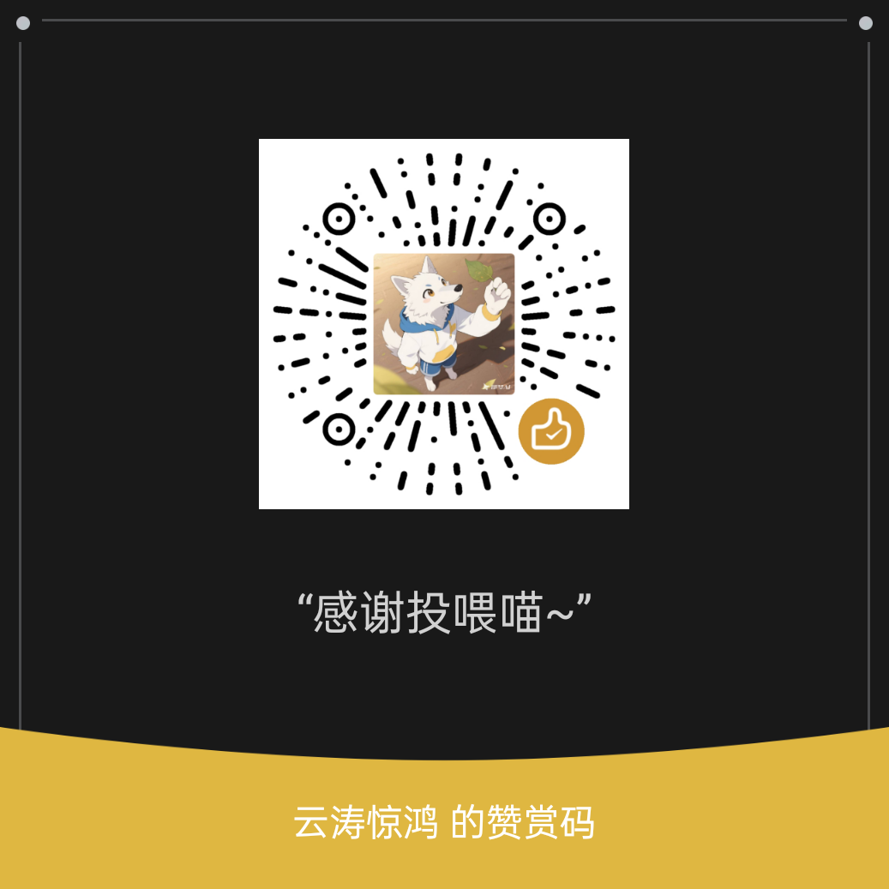

# 🪨 磐石 · 智能群管

> 稳如磐石的 QQ 群管家 —— 听得懂人话，又不乱烧 token。

[](https://www.gnu.org/licenses/gpl-3.0.html)
[](https://github.com/AstrBotDevs/AstrBot)
[](https://github.com/yuntaojinghong/astrbot_plugin_panshi/releases)

一个为 [AstrBot](https://github.com/AstrBotDevs/AstrBot) 打造的 QQ 群管理插件，基于 NapCat / OneBot v11（`aiocqhttp`）协议。

**🌐 项目主页：** https://yuntaojinghong.github.io/astrbot_plugin_panshi/

> **当前版本 v1.13.0** · 48 个指令 · 8 个 LLM 工具 · 10 类功能 · 9 组配置


## ✨ 特色

| 特色 | 说明 |
|---|---|
| 🖥️ **自带配置面板** | 插件详情页点开即用。自动识别机器人所在的所有群，左侧列表切换、右侧可视化改配置，不用手动翻 JSON |
| 🧠 **听得懂人话** | 直接说「把刚才刷屏的禁言十分钟」即可，无需记指令。混合模式：指令秒回，自然语言交给 AI |
| 🚦 **本地意图闸门** | v1.6.0 核心：四道零成本本地判定（上下文作证 / 效果动词 / 否定闲聊 / 额度冷却）先筛一遍，**实测拦截约 95% 的废话**，不再让闲聊白烧 token |
| ⚡ **本地快路径** | 常见指令式表达在本地直接解析执行，零 token、毫秒级响应 |
| ⏱️ **人话时长** | 支持 `30s` / `10m` / `2h` / `1d` / `1h30m`，不用心算秒数 |
| 🎯 **智能定位目标** | 引用消息 > @某人 > QQ号 > 名字模糊匹配，四种方式自动选择 |
| 🛡️ **高风险确认** | 踢人 / 拉黑等不可逆操作，AI 会先复述并请你确认 |
| 🎨 **增强欢迎** | 多模板随机 + 变量替换（`{at}{昵称}{群名}{人数}{时间}`）+ 图片 + 延时 |
| 🔢 **入群验证** | 算术验证码，答对才通过，拦截广告机器人 |
| ⚠️ **三级警告** | 警告累计自动升级：达阈值自动禁言 → 再达阈值自动踢出 |
| 🎲 **互动玩法** | 投票 / 接龙 / 自助查询 / 关键词自动回复，活跃群氛围 |
| 🎛️ **群内面板与自检** | `/面板` 直接在群里查看与改配置，`/自检` 一键体检依赖与协议端状态 |
| 💾 **零依赖存储** | JSON 文件持久化，无数据库，即装即用 |
| 🧩 **模块化架构** | 每个功能独立模块，二次开发只需照着模板加 |

## 🖥️ 配置面板

插件带一个独立的图形配置面板，**不用改 JSON、不用记字段名**。

### 怎么打开

1. 进入 AstrBot WebUI 的**插件管理**页
2. 点击「磐石 · 智能群管」插件的 logo，进入**插件详情页**
3. 在「插件行为 / Pages」区域点击 **`settings`** 的「打开」

> 打开前请确保已按「安装后配置」连好 NapCat。群列表需要协议端在线才能拉到；没连上时面板会给出排查提示，而不是静默空白。

### 面板能做什么

| 区域 | 功能 |
|---|---|
| **左侧群列表** | 自动拉取机器人所在的所有群，显示群名 / 群号 / 人数 / 机器人角色，支持按群名或群号搜索、一键同步 |
| **状态概览** | 顶部四张卡片显示纳管群聊数、记录用户数、累计警告数、黑名单人数 |
| **全局默认配置** | 列表第一项，作为所有群的模板。按 7 组折叠分区编辑，每项都带中文说明提示 |
| **配置备份** | 一键导出全部配置（含各群独立配置）为 JSON；换机或改坏时可一键导入恢复 |
| **按群独立配置** | 选中任意群，可「改为独立配置」单独设置该群规则；不想改了随时「恢复默认」回到继承状态 |
| **跟随默认** | 群默认继承全局配置，此时表单只读预览。切换群/保存都会自动落盘 |

### 配置项提示

面板里每个字段都带 `?` 图标和下方说明文字，鼠标悬停可看完整提示。例如：

- 「刷屏判定：时间窗内消息条数」→ 在下方时间窗内发送超过这么多条消息即判定为刷屏
- 「默认禁言时长」→ 执行禁言且未指定时长时使用
- 「警告记录有效期」→ 超过有效期自动清除，0 表示永久

> **要求**：AstrBot **4.24.2 或更高版本**。低版本没有插件 Pages 机制，面板不会出现，但群管功能不受影响。

## 📦 安装

### 方式一：下载压缩包（推荐，最简单）

1. 前往 [Releases 页面](https://github.com/yuntaojinghong/astrbot_plugin_panshi/releases) 下载 `astrbot_plugin_panshi.zip`
2. 解压后得到 `astrbot_plugin_panshi/` 文件夹
3. 把整个文件夹放入 AstrBot 的 `data/plugins/` 目录
4. **重启 AstrBot**（或在 WebUI 插件管理页点「重载插件」）

### 方式二：Git 克隆

```bash
cd AstrBot/data/plugins
git clone https://github.com/yuntaojinghong/astrbot_plugin_panshi.git
```

### 安装后配置

前往**插件详情页 → Pages → settings** 打开配置面板（推荐），
或在插件配置页直接编辑七组配置项，发送 `/群管帮助` 查看完整指令。


## ⌨️ 指令一览

### 基础管理
| 指令 | 说明 | 权限 |
|---|---|---|
| `/禁言 @某人 10m` | 禁言，时长人话化 | 管理员 |
| `/解禁 @某人` | 解除禁言 | 管理员 |
| `/全禁 开\|关` | 全体禁言 | 管理员 |
| `/踢 @某人 [原因]` | 踢出 | 管理员 |
| `/拉黑 @某人` | 踢出并拉黑 | 管理员 |
| `/撤回 [N]` | 撤回引用消息 / 最近 N 条 | 管理员 |
| `/净化 [N]` | 批量清屏（默认 30 条） | 管理员 |
| `/改名 @某人 昵称` | 修改群名片 | 管理员 |
| `/头衔 @某人 头衔` | 设置专属头衔 | 群主 |
| `/上管 /下管 @某人` | 管理员任免 | 群主 |
| `/设精 /移精` | 引用消息设/移精华 | 管理员 |
| `/群名 新名字` | 修改群名 | 管理员 |
| `/公告 内容` | 发布群公告 | 管理员 |
| `/群员` | 群成员概览 | 所有人 |
| `/宵禁 状态` | 查看宵禁设置 | 管理员 |
| `/宵禁 开\|关` | 开启/关闭宵禁 | 管理员 |
| `/宵禁 23:30-07:00` | 设置宵禁时段并开启（即时生效） | 管理员 |

### 警告系统
| 指令 | 说明 |
|---|---|
| `/警告 @某人 [原因]` | 记录一次违规 |
| `/撤销警告 @某人 [N]` | 撤销警告 |
| `/违规记录 [@某人]` | 查看违规历史 |

### 群活跃
| 指令 | 说明 |
|---|---|
| `/签到` | 每日签到得积分 |
| `/积分 [@某人]` | 查询积分 |
| `/排行 [积分\|发言]` | 排行榜 |

### 互动玩法
| 指令 | 说明 |
|---|---|
| `/投票 <主题> <选项...>` | 发起投票，自动统计票数 |
| `/接龙 <开头>` | 发起接龙，自动记录顺序 |
| `/查 <关键词>` | 群内自助查询（违禁词 / 配置 / 状态） |
| 关键词自动回复 | 命中预设关键词自动答，无需 @机器人 |

### 小游戏（v1.13.0）
所有触发词都是**整句精确匹配**，不会抢群里的正常聊天。

| 玩法 | 怎么玩 | 说明 |
|---|---|---|
| 猜数字 | 直接发「猜数字」开局，再发数字来猜 | 猜错提示大小；猜中得积分。有开局冷却与每日发奖局数上限 |
| 摇骰子 | 直接发「摇骰子」或「摇骰子 3」 | 纯娱乐，不影响积分 |
| 猜拳 | 直接发「猜拳石头 / 猜拳剪刀 / 猜拳布」 | 纯娱乐，不影响积分 |
| 押注 | 直接发「押注 10」 | 与机器人比骰子点数，赢 +N、输 −N、平局退还。**默认关闭**，有单次与每日净输上限 |

> 猜数字只在**本群正好有一局在进行中**时才会把纯数字消息当成猜——
> 其它时候纯数字一律放行，所以不会把日常聊天里的数字吃掉。

### 积分怎么赚（v1.13.0）
| 途径 | 说明 | 默认 |
|---|---|---|
| 签到 | 基础分 + 随机奖励 | 开 |
| **连签加成** | 连续签到每多一天多给一份，**封顶**避免失控；断签重新算 | +2/天，封顶 30 |
| **早鸟奖** | 当天**第一个**签到的人额外得一份 | +5 |
| **发言得积分** | 有效发言得分。带最短字数、冷却、每日上限三道闸 | **默认关** |
| **新人礼包** | 入群后第一次发言一次性奖励 | +20 |
| **参与互动** | 投票、接龙各得一份分，共用每日上限 | 各 +2，上限 30 |

> 所有数值都能在面板「群积分 / 互动工具」里改。发言得分**默认关闭**，
> 因为它是最容易被刷的一个——要开请务必保留冷却与每日上限。

### 面板与自检
| 指令 | 说明 |
|---|---|
| `/面板` | 在群里直接查看与修改配置，不用开 WebUI |
| `/自检` | 一键体检：依赖、协议端连接、配置完整性 |
| `/配置 <项> <值>` | 快速改单个配置项 |
| `/帮助` | 按分组列出全部可用指令 |

### 智能交互（核心特色）
直接对机器人说人话，例如：

```
把刚才刷屏的禁言十分钟
@张三 再发广告就踢了
全群安静一下
把这条广告撤了            （引用广告消息后发送）
管管这个发链接的
宵禁改到23点半到7点       （自然语言设置宵禁，立即生效）
把'加微信'加进违禁词      （自然语言维护违禁词）
```

触发条件（可在配置中开关）：
- 消息 @了机器人
- 消息以机器人称呼开头（默认「磐石」「群管」）
- 消息含管理动作词（禁言/踢/撤回/警告/宵禁/违禁词…）
- **满足本地意图闸门**（见下节，不消耗 token）

> 面板里保存的配置（含宵禁开关与时段）**即时生效**，无需重载插件。

## ⚙️ 配置说明

配置分为 8 组，在 AstrBot WebUI 插件配置页可视化编辑：

- **基础设置**：超管名单、默认/最大禁言时长、启用群范围、操作播报
- **反垃圾防护**：违禁词（支持 `re:` 正则）、内置词库、刷屏检测、广告拦截、复读打断
- **入群欢迎**：欢迎模板（支持变量）、欢迎图片、延时、算术验证、入群禁言、退群通知/拉黑、进群审核
- **警告系统**：自动禁言阈值、自动踢出阈值、记录有效期
- **智能识别**：总开关、触发方式、**意图额度**、**闸门冷却**、**本地快路径**、高风险确认、指定 LLM 供应商、机器人称呼
- **群活跃**：签到开关、基础积分、随机奖励
- **自动化**：宵禁开关与时段、定时公告（内容 + 间隔，自动发到所有纳管群）

## 🧠 智能识别原理

采用**混合模式**，兼顾智能与成本。核心设计：**能用本地规则判断的，绝不交给模型**。

```
消息进来
  ├─ 是 /指令                 → 直接执行（零 token，毫秒级）
  ├─ 本地快路径命中            → 本地解析执行（零 token，毫秒级）
  └─ 意图闸门放行              → 交给 LLM 解析意图
                                 ├─ 收集上下文（引用 / 最近发言 / @对象 / 群成员）
                                 ├─ LLM 输出结构化 JSON
                                 ├─ 目标解析（名字模糊匹配 / 最近刷屏者推断）
                                 ├─ 权限校验
                                 └─ 高风险操作 → 确认后执行
```

### 本地意图闸门（v1.6.0 新增）

早期版本靠「软信号词表」（出现"帮我""麻烦""怎么办"就送模型），但这些词在日常闲聊里出现频率极高 —— 等于把大量废话灌给模型，token 白烧。

v1.6.0 改为 **IntentGate 四道本地零成本闸门**，依次判定：

| 闸门 | 判定内容 | 例子 |
|---|---|---|
| ① 上下文作证 | 群内**最近消息里确实存在异常**（刷屏 / 广告 / 违禁词 / 争吵） | 刚有人连发 5 条 → 放行 |
| ② 效果动词 | 消息里有可执行的动作词 | 禁言 / 踢 / 撤回 / 警告 / 宵禁 |
| ③ 否定与闲聊 | 明显是吐槽、玩笑、否定句 | "别禁言他" → 拦截 |
| ④ 额度与冷却 | 令牌桶限流 + 冷却窗口 | 每群额度用完即停 |

四道全过才送模型，因此：

- **token 消耗大幅下降** —— 实测本地拦截率约 95%
- 额度可调（`intent_budget` / `intent_cooldown`），随时按群里活跃度松紧
- 闸门**完全本地运行**，不产生任何 API 调用
- 已解析过的相同句子会在 120 秒内命中缓存，直接复用结果

> 没配 LLM 供应商也能用：闸门放行后若无可用模型，插件自动回退到本地规则解析。

## 📁 目录结构

```
astrbot_plugin_panshi/
├── main.py                 # 主入口：指令注册 + 事件监听 + LLM 工具 + 面板注册
├── metadata.yaml           # 插件元数据
├── _conf_schema.json       # 配置 schema
├── pages_api.py            # 配置面板：Web API 路由
├── pages_service.py        # 配置面板：业务逻辑（配置读写/群列表/校验）
├── logo.png                # 插件图标
├── pages/                  # 配置面板前端
│   └── settings/
│       ├── index.html      # 面板页面结构
│       ├── style.css       # 样式（跟随 AstrBot 明暗主题）
│       └── app.js          # 面板交互逻辑
├── config/                 # 配置封装（含 schema 快照与校验）
├── core/                   # 功能模块
│   ├── base_handle.py      # Handle 基类
│   ├── normal.py           # 基础管理
│   ├── guard.py            # 反垃圾防护
│   ├── welcome.py          # 入群欢迎 + 验证
│   ├── join.py             # 进群审核
│   ├── warning.py          # 警告系统
│   ├── activity.py         # 签到/积分/排行
│   ├── automate.py         # 宵禁/定时
│   ├── context.py          # 智能上下文收集
│   ├── intent.py           # 自然语言意图解析（三级优先级调度）
│   ├── intent_gate.py      # 本地意图闸门（四道零成本判定 + 额度/缓存）
│   └── intent_executor.py  # 意图执行（含确认机制）
├── data/                   # JSON 持久化 + 群信息缓存
│   ├── storage.py          # 线程安全 JSON 存储
│   └── group_cache.py      # 群列表自动识别与缓存
├── utils/                  # 工具（时长/目标/权限解析）
└── scripts/                # 开发脚本（不随插件分发）
    └── build_release.py    # 生成安装压缩包
```

## 🔌 面板接口一览

面板前端通过 `window.AstrBotPluginPage` bridge 调用以下接口，
路由带插件名前缀 `/astrbot_plugin_panshi/...`：

| 方法 | 路由 | 说明 |
|---|---|---|
| GET | `/bootstrap` | 面板初始化（schema + 群列表 + 全局配置 + 连接诊断） |
| GET | `/overview` | 运行状态概览（群数/用户数/警告数/黑名单） |
| GET | `/connection` | 协议端连接诊断（适配器/在线账号/通道状态） |
| GET | `/groups` | 群列表（`?force=1` 强制刷新） |
| POST | `/groups/refresh` | 清缓存并重新同步群列表 |
| GET | `/global` | 读取全局默认配置 |
| POST | `/global` | 保存全局默认配置（保存后自动化设置即时生效） |
| GET | `/group?group_id=xxx` | 读取某群配置（含生效值与覆盖项） |
| POST | `/group` | 保存某群配置 / 切换跟随状态 |
| POST | `/group/reset` | 清除某群覆盖，恢复跟随全局 |
| GET | `/export` | 导出全部配置为 JSON 备份 |
| POST | `/import` | 导入 JSON 备份，覆盖当前全部配置 |

## ❓ 常见问题

### 面板提示「未找到平台适配器」

说明 AstrBot 里没有任何已加载的平台适配器实例。

1. 打开 AstrBot 控制台 →「平台」页，确认已添加 **aiocqhttp** 类型的适配器（用于 NapCat / OneBot v11），并且开关是**启用**状态；
2. 保存后重启 AstrBot（适配器是在启动时实例化的，新增后不重启不会生效）；
3. 回到面板点「同步」。

### 面板提示「已找到平台适配器，但尚未与协议端建立连接」

NapCat 进程开着，**不等于**已经连上 AstrBot —— 连接方向是 **NapCat 主动连 AstrBot**。

1. 在 NapCat 里新增一个「**WebSocket 客户端**」网络配置；
2. URL 填 `ws://<AstrBot 地址>:<端口>/ws`，端口取 AstrBot aiocqhttp 适配器配置中的「反向 WebSocket 端口」（默认 `6199`）；
3. 若 AstrBot 侧设置了 `ws_reverse_token`，NapCat 的 Access Token 必须填完全一致的字符串；
4. NapCat 跑在 Docker 里时，地址不能用 `127.0.0.1`，要填宿主机可达的 IP；
5. 连上后 AstrBot 日志会打印 `aiocqhttp(OneBot v11) 适配器已连接。`

### 群列表为空，但没有报错

机器人不在任何群里（或只在小号私聊中）。把机器人拉进任意一个群后点「同步」。

## 🔧 开发与打包

```bash
# 生成 dist/astrbot_plugin_panshi.zip（用于发布 Release）
python scripts/build_release.py

# 脱离 AstrBot 的自测（校验模块可加载、工具函数正确）
python _selftest.py
```


## 💡 灵感来源

本插件的功能设计参考了社区优秀项目 [astrbot_plugin_qqadmin](https://github.com/Zhalslar/astrbot_plugin_qqadmin)（作者 Zhalslar，GPL-3.0），并在其基础上重新设计了交互方式（人话时长、自然语言意图识别、警告升级、增强欢迎、零依赖存储等）。在此致谢。

## ⭐ 支持项目

磐石完全免费开源（GPL-3.0），会持续更新。如果它帮你把群管得井井有条：

- 给仓库点个 [Star](https://github.com/yuntaojinghong/astrbot_plugin_panshi) —— 最大的鼓励；
- 微信扫一扫，请作者喝杯奶茶（感谢投喂喵~）：

<p align="center">
  
</p>

## 📝 更新日志

完整历史见 [Releases 页面](https://github.com/yuntaojinghong/astrbot_plugin_panshi/releases)。

### v1.13.0 — 面板显示「机器人在群里的身份」+ 退群立刻从列表移除
- **新增身份徽章**：群列表里每个群后面显示机器人是本群 **群主 / 管理员 /
  普通成员 / 身份未知**，鼠标悬停有说明；选中某个群时标题里也会写
  「我是管理员 / 我只是普通成员（禁言/撤回/踢人会失败）」。
  - 「普通成员」用**警示色**——那是最需要立刻知道的状态：机器人照样能检测、
    记警告、扣分，但所有"动手"的操作都会失败。
  - 为什么以前没有：OneBot 的 `get_group_list` **不返回**机器人自己的角色，
    只有 `get_group_member_info` 才有。现在逐群查一次并单独缓存 5 分钟
    （角色变化很慢），带并发上限与短超时；查不到就显示「身份未知」，
    **绝不假报身份**——写着"管理员"却动不了手，比什么都不写更糟。
- **修复：机器人退群后，面板里还挂着那个群。** 群缓存有 60 秒有效期，
  退群通知到达时也没人清理。现在收到「机器人自己退群 / 被踢」的通知
  就**立刻把该群从缓存里摘掉**。

### v1.12.0 — 积分获取途径扩充（连签加成 / 早鸟奖 / 发言得分 / 新人礼包 / 互动得分）
- **连签加成**：连续签到每多一天多给一份，**封顶**——不封顶的话连签一个月会
  变成一个谁都没预期的数字；断签从第 1 天重新算。
- **早鸟奖**：当天第一个签到的额外奖励。名额在**锁内抢占**，两人同时签到
  不会都拿到。
- **发言得积分**（**默认关**）：四道闸——开关 / 最短字数 / 冷却 / 每日上限。
  没有冷却和上限的"发言给分"就是把积分系统交给刷屏脚本。
- **新人礼包**：入群后第一次发言一次性奖励，每人只发一次。
- **每日首次发言**额外奖励。
- **参与互动得分**：投票、接龙各得一份，共用每日上限（互动能重复参与，
  不封顶就是多一个刷分入口）。
- 实现细节：每日上限按**积分**夹紧（不是按次数），否则「上限 50、每笔 +20」
  第三笔就会变成 60，用户看到的数字和配置对不上。
- 一次性/每日名额走**锁内抢占**的独立账本（不往用户表塞假用户，
  否则排行榜和人数统计会把它当真人）。

### v1.11.0 — 群内小游戏（猜数字 / 摇骰子 / 猜拳 / 可选押注）
- 新增配置组 **「小游戏」**，所有触发词都是**整句精确匹配**，不抢正常聊天。
- **猜数字**：发「猜数字」开局，发数字来猜；猜错给大小提示，猜中得积分。
  有开局冷却与每群每日发奖局数上限——没有这两道闸，它就是台无限发分机。
- **摇骰子 / 猜拳**：纯娱乐，不影响积分。
- **押注**（默认关闭）：与机器人比骰子点数，赢 +N、输 −N、平退还；
  有单次上限与**每人每天净输上限**，避免有人一夜清零。
- 关键安全设计：**只有本群正好有一局猜数字在进行中时**，纯数字消息才会被
  当成"猜"；其余时候纯数字一律放行。

### v1.10.0 — 积分跨群共用（可选开关）
- 新增 `群积分 → 积分跨群共用`（默认关）。开启后**所有群共用一份积分**、
  **签到每天只算一次**、**违规扣分跨群生效**、**排行变成全服榜**；
  切换后积分从零重算，历史分保留在各自群里。
- 界限：只有积分和签到跨群；违规记录、发言数、购买/抽奖记录、限购计数
  仍按各自的群走。
- 修：面板概览的「纳管群聊」不再把内部保留键当成真实群（会多算 1）。

### v1.9.16 — 裸词快捷触发 + 修掉「启用签到」假开关
- **不打斜杠也能用**：直接发「积分」「签到」「积分排行」「积分商城」「抽奖」
  等词即可。整句精确匹配，句中夹着这些词不会触发。
  可在「互动工具 → 裸词快捷触发」里开关并自定义关键词。
- 修：`启用签到` 以前只影响面板显示，关掉后 `/签到` 照样加分——现在真的能关掉。

### v1.7.4 — 修复两个线上 bug：「按群配置静默失效」与「关闭全体禁言反被开启」
- **修复：按群独立配置静默失效**（日志 `cannot pickle '_thread.lock' object`）
  - **现象**：群里每条消息都打三条警告/错误——`读取按群配置失败，已退化为全局配置`、`自动回复异常`、`智能识别异常`，**按群独立配置完全不生效**
  - **根因**：AstrBot 传入的配置对象 `AstrBotConfig` 是 `dict` 子类，但实例上挂了
    `_save_state_lock` / `_save_commit_lock`（`threading.Lock`）。`for_group()` 里的
    `copy.deepcopy` 对 dict 子类会去 pickle 它的 `__dict__`，撞上锁直接抛
    `TypeError: cannot pickle '_thread.lock' object`；异常被 `cfg_for()` 的兜底
    catch 成「退化为全局配置」——**不崩溃、不报错，只是按群配置全部失效**
  - **修法**：`_safe_deepcopy()` 先试常规深拷贝，失败则只取字典内容再深拷（只丢实例属性、不丢配置数据）
  - **为什么以前没发现**：自测里的配置一直是普通 `dict`，`deepcopy` 不走 `__dict__`，所以永远复现不出来。现已补上「带锁配置对象」的回归用例
- **修复：说「关闭全体禁言」却被执行成「开启」**（实测对同一个群连说三次，三次都被开启）
  - **根因**：本地规则的动作词表里，解除侧只有 `解禁 / 解除 / 取消 / 放开 / 恢复 / 开禁`，**没有「关闭」**。于是「关闭全体禁言」落到兜底分支命中「全体禁言」→ 判成 `enable=True`。而本地规则在 `main.py` 里**先于** LLM 闸门运行，所以它一口咬定要开启，根本不问模型
  - **修法**：按「否定动词**紧邻**关键词」判定（`_is_negated`），而不是往全局词表里塞「关闭」——后者会把「关闭宵禁」也误判成解除全体禁言
  - 顺带把「取消/停止」从**否定前缀**里移除：它们是「关掉某功能」的正常指令动词，此前被判成否定指令后整句返回 `None`，于是既没关掉、也不回复
  - 新增 `_is_negated_open()` 处理「别开全体禁言」这类否定修饰开启动作的语序
  - **宵禁路由**：`set_curfew` 提到 `whole_ban` 之前判定（「关闭宵禁」里含「关闭」，且宵禁本就靠全体禁言实现，容易被整段抢走）
- 新增自测回归：`FOR_GROUP_LOCKED_CONFIG_OK`、`WHOLE_BAN_NEGATION_OK`、
  `WHOLE_BAN_E2E_OK`（连回复文案一起断言）、`CURFEW_ROUTING_OK`、`TOGGLE_DIRECTION_OK`
  （穷举「关闭/取消/停止/别开 X」不得产生 `enable=True`，同时确认开启侧没被修死）

### v1.7.0 — 面板体验：群头像 / 插件图标 / 切换更跟手 / 恢复默认更可靠
- **群头像**：左侧群列表显示真实群头像（协议端 `get_group_info` 不返回头像，改用按群号取的公开接口）。加载失败自动回退成首字图标，不会留破图；`loading=lazy` 让群多时首屏不受阻
- **插件图标**：面板左上角改用插件自带的 `logo.png`（此前是一个「磐」字方块）。该图标在插件页面里的静态资源路径随 AstrBot 版本不同，因此**逐个候选路径尝试**，全部失败才回退成「磐」字
- **切换更跟手**：
  - 点击立即高亮 + 内容区显示加载态，不再出现"点了没反应"
  - 加请求序号丢弃过期响应——快速连点多个群时，先前发出的请求若后返回，不会再把你后点选的群覆盖掉
- **「恢复默认」改用页面内确认框**（不再依赖原生 `confirm()`）
  - 原生 `confirm()` 在 iframe 未授予 `allow-modals` 时会被直接拦掉（返回 false 且不报错），而「恢复默认」正是靠它兜底的——被拦掉的表现就是**点了没反应、改不回默认配置**，且完全查不出原因
  - 现在改为自绘对话框，不依赖该权限；「导入配置」的确认同样换掉
- **新增 `tests/test_panel_frontend.js`**：用 jsdom 覆盖以上全部行为（头像地址与回退、图标候选逐试、加载态、自绘确认框且断言原生 `confirm()` 零调用），并接入 CI

### v1.6.2 — 适配插件市场安全审查（日志导入规范）
- **改为只从 `astrbot.api` 导入 logger**：此前每个模块都写成 `try: from astrbot.api import logger / except: import logging`，这个回退分支被 AstrBot 插件市场安全审查判定为「日志使用违反规范」（要求 logger 必须且只能从 `astrbot.api` 导入，禁止使用 Python 内置 `logging.getLogger`）。现已删除全部 15 个文件中的回退分支，统一为 `from astrbot.api import logger`
- 这是审查唯一未通过项，其余（无恶意代码、无网络外联、无 `eval/exec/subprocess`、无遥测）均判定合规
- 行为无变化：`astrbot.api.logger` 本就是 AstrBot 提供的插件专用 logger，错误/警告/信息输出位置与格式不变

### v1.6.1 — 修复「按群独立配置」与宵禁解禁的遗留问题
- **修复 #1（按群独立配置仍不生效）**：v1.6.0 只给 `guard` / `panel` 接上了按群配置视图，欢迎语、入群审核、积分、警告阈值仍读全局值，导致面板上「独立配置」看着生效、实际没用。现已全部改走 `cfg_for()`
- `guard.whitelist` / `anon_nicknames` 也改为按群读取，单群加的白名单才能真正豁免
- 修复「改回全局值」改不回来：保存改为整组替换语义，把值改回全局后旧覆盖会被清掉
- 修复 `follow_default` 在面板与运行时默认值相反的问题（老备份导入后会出现「面板显示跟随全局、实际按独立配置执行」）
- `basic` 分组按字段白名单支持按群覆盖（`anon_protect` / `anon_nicknames` / `default_ban_time` / `operation_notice`）；`interact` 整组可按群覆盖；面板把不能按群配置的字段显示为只读，不再出现「能改但存不进去」的假开关
- **修复 #2（关闭宵禁不解禁）的残留形态**：宵禁禁言群列表改为持久化，插件重启后也能补解禁；解禁失败会回报 `lift_failed` 而不是谎报「已解除」，并每分钟重试
- **修复 `/禁言 @某人 10m` 时长被 QQ 号劫持**：此前会把 `[CQ:at,qq=123456789]` 当成时长，禁言 123456789 秒（被上限截成 30 天）
- **修复否定指令被执行**：「别禁言@张三」「不用禁言他」以前会被解析成禁言并立即执行
- 修复意图闸门被动作关键词绕过（额度/冷却失效）、本地可解析的指令被闸门吞掉且无回复、群友闲聊被回「权限不足」
- 修复 `bool("false") is True` 导致「关闭全体禁言」执行成开启；`count` 为「3条」时不再抛异常
- 修复面板多行配置（阶梯处置 / 自动回复规则）被渲染成单行输入、换行被吞
- 修复入群邀请（`sub_type=invite`）被当 `add` 处理、且失败仍提示成功
- 修复警告自动处置失败时谎报「已禁言/已踢出」
- 修复 `curfew_ban_time` 是个假开关（schema 与向导都在宣传，但没人读）——现已在宵禁时段真正生效
- 协议端调用补短超时，避免半连接时把宵禁/公告循环卡住数分钟

### v1.6.0 — 意图闸门 + 面板动效
- **新增本地意图闸门（IntentGate）**：四道零成本本地判定取代旧软信号词表，实测拦截约 95% 的无效解析请求，token 消耗大幅下降
- 新增意图缓存（相同句子 120 秒内复用结果）
- 新增「本地快路径」：常见指令式表达本地直接执行，不等模型
- 配置面板补背景动效与入场动画，并完整支持 `prefers-reduced-motion` 降级
- 配置项新增 `intent_budget` / `intent_cooldown` / `local_fast_path`

### v1.5.1 — 修复自然语言指挥报「没有 LLM 服务商」
- 修复未配置 LLM 供应商时自然语言指令直接失败的 bug
- 供应商解析改为三级回退：指定 ID → 当前使用中 → 任意可用，并输出可诊断日志

### v1.5.0 — 自然语言升为主路径
- LLM 成为自然语言的主要解析器，本地规则降级为零成本快路径
- 支持自然语言设置宵禁、维护违禁词，保存后即时生效

### v1.4.2 — 稳定性修复
- 修复若干配置读写与边界判断问题

## 📄 许可

GPL-3.0
